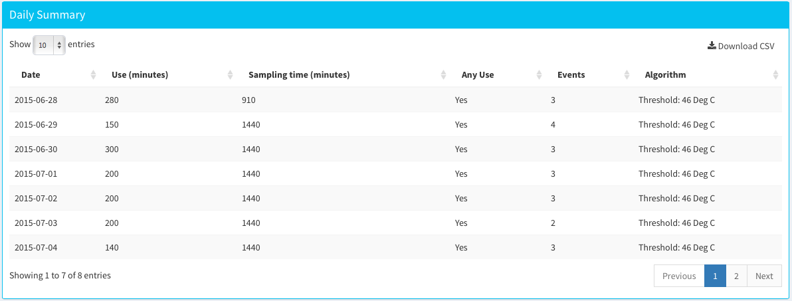
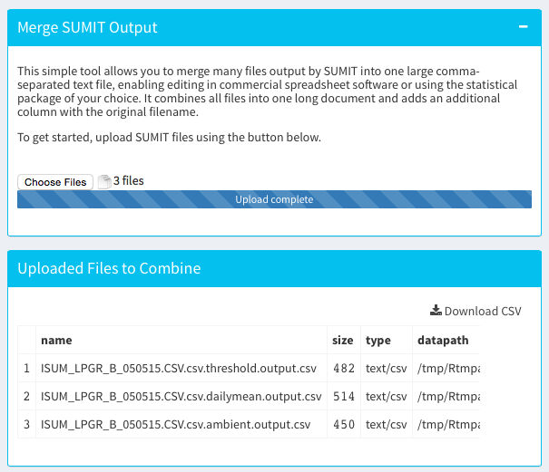

# SUMIT
### An R and Shiny-based tool for analyzing iButton Stove Use Monitor Data

# Table of Contents
  * [Overview](#Overview)
  * [Installing SUMIT](#installing-sumit)
  * [Using SUMIT](#using-sumit)
  * [Analyzing Files](#analyzing-files)
  * [SUMIT's Algorithms](#sumit-currently-contains-3-distinct-algorithms-to-analyze-sums-files)
  * [Downloading Raw Data](#downloading-raw-data)
  * [Combining Analyzed and Downloaded Summary Files](#combining-analyzed-and-downloaded-summary-files)

###Overview
SUMIT is an easy-to-use and simple tool for preliminary analysis of SUMs data from iButtons. It is made for rapid visualization and analysis of a small number of files; it is not suited for analysis of large amounts of SUMs data. SUMIT requires R, some visualization and analysis libraries, and a modern web browser (Chrome recommended) to work. SUMIT currently accepts only csv files from Maxim's OneWireViewer, the free software used to download data from iButtons.

###Installing SUMIT
SUMIT can be run locally or on the web. To run SUMIT on your own computer, you must first download and install R (version 3.0 or later), available here:

[https://cran.rstudio.com](https://cran.rstudio.com)

Choose the file appropriate for your platform (Linux, Mac OS X, or Windows) and follow the onscreen instructions. After R is installed, run the following code to install required packages:

```R
# install missing packages.
list.of.packages <- c("shiny","reshape2","plyr","lubridate","data.table","dygraphs","xts","devtools","shinydashboard","shinyBS","scales")
new.packages <- list.of.packages[!(list.of.packages %in% installed.packages()[,"Package"])]
if(length(new.packages))(print(paste("The following packages are not installed: ", new.packages, sep="")))else(print("All packages installed"))
if(length(new.packages)) install.packages(new.packages)
lapply(list.of.packages,function(x){library(x,character.only=TRUE)}) 
```

SUMIT can be run in three ways after R and the appropriate packages are run:

```R
# 1. Use runGitHub
runGitHub("sumit", "ajaypillarisetti")

# 2. Run a zip file using runUrl
runUrl("https://github.com/ajaypillarisetti/SUMIT/archive/master.zip")
```

Finally, you can clone the source code of SUMIT from 

[https://github.com/ajaypillarisetti/SUMIT/archive/master.zip](https://github.com/ajaypillarisetti/SUMIT/archive/master.zip)
 
Clone the repository and use `runApp()`:

```R
# Clone with git. If you have cloned it into
# ~/sumit, cd to that directory and use runApp().
setwd("~/sumit")
runApp()
```

###Using SUMIT
####Uploading Files
Use of SUMIT begins with temporarily uploading a file using its File Browser interface. Click the “Choose File” button to select a File for use in SUMIT. SUMIT accepts any iButton csv downloaded using Maxim’s free One Wire Viewer[^1].


After successful upload, a graph and a number of info boxes will be displayed in the Main SUMIT window.


All graphs in SUMIT are fully interactive; click and drag to zoom in on specific portions of the graph that may be of interest (see below). Double-clicking on the graph zooms out. To the right of the graph, SUMIT displays summary information about the uploaded file. THis includes the total days of sampling, the number of samples logged, the logging interval, and two intelligent diagnostics to assess the health of the iButton. These diagnostics determine hte type of iButton used to collect data and indicate if the max or min temperatures have been exceeded. If so, as is the case in the example above, a warning symbol is displayed.[^2] 


####Analyzing Files
Click the SUMs Analysis Tab to select algorithms you can use to analyze your data. All algorithm tabs share some common features, including five summary boxes that describe the data selected in the graph (defaults to the entire uploaded datafile):


- The total use minutes 
- The days of sampling
- The average daily minutes of use
- The average daily minutes of use on days with use (excluding days with no cooking)
- The average number of uses on days with use (excluding days with no cooking)

Each tab also outputs a graph generated on the screen and a table of summary results by day. 




Both the graph and the summary can be downloaded by clicking the "Save" and "Download CSV" buttons.  

#####SUMIT currently contains 3 distinct algorithms to analyze SUMS Files

*Threshold Algorithm*
This algorithm looks at the time above a specific, user-set temperature. The slider on the page can be used to adjust the threshold. Like elsewhere, click and drag over the graph to zoom in; to zoom out, double click on the graph.

This algorithm works best for very clean signals from low thermal mass stoves (rocket stoves, advanced cookstoves, and fuel and electric stoves).

*Daily Mean Algorithm*
This algorithm calculates the daily average temperature. Events are defined as temperatures above the daily average temperature plus X * daily standard deviation of the temperature. The slider on the page can be used to adjust the standard deviation threshold (X). As elsewhere, click and drag over the graph to zoom in; to zoom out, double click on the graph.

This algorithm works best for low thermal mass stoves (rocket stoves, advanced cookstoves, and fuel and electric stoves) that may have more ambiguous signals.

*Ambient-corrected Algorithm*
The third - and most complicated - algorithm looks for deviations from mean hourly ambient temperature to determine cooking. Using this algorithm requires uploading an ambient temperature file spanning the same period as the originally uploaded SUMs file. 

The sliders on the page can be used to adjust parameters. The Ambient SD threshold slider indicates the number of SDs above the mean hourly ambient temperature that will determine cooking. Because ambient temperature data may not line up perfectly with stove temperature data, a minimum cooking temperature can be set. 

This algorithm can produce the most accurate, consistent results if ambient temperatures are available. It also can be useful for analyzing data from large stoves -- such as planchas -- that have significant thermal inertia. 

####Downloading Raw Data
Raw, cleaned data can be downloaded as a text-file (comma separated values) from the Raw data tab.

####Combining Analyzed and Downloaded Summary Files
To facilitate further analysis in a spreadsheet or statistical analysis package, CSVs output from SUMIT can be merged using the "Merge Files" tab. This simple tool allows you to merge many files output by SUMIT into one large comma-separated text file, enabling editing in commercial spreadsheet software or using the statistical package of your choice. It combines all files into one long document and adds an additional column with the original filename.

To begin, click "Choose Files." A file selection dialog box -- which will allow selecting multiple files -- will open. 



After combining files, the lower table will populate with the original file names and allow you to download a combined CSV by clicking "Download CSV".

[^1]: To download One Wire Viewer, visit [Maxim](http://www.maximintegrated.com/en/products/ibutton/software/1wire/OneWireViewer.cfm). OWV works on Windows only. 
[^2]: We strongly advise not using any iButtons that show negative values or exceed their maximum temperature regularly. This buttons are error prone and may fail with data loss during a deployment.
